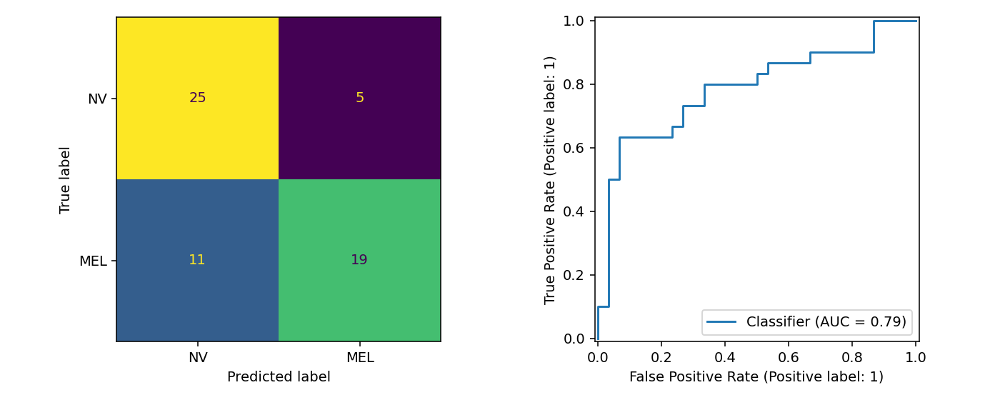
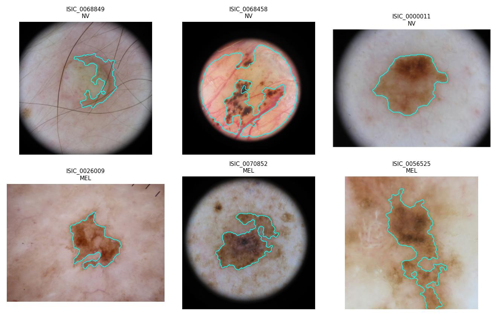
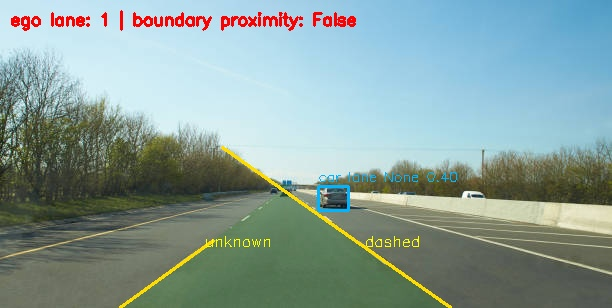
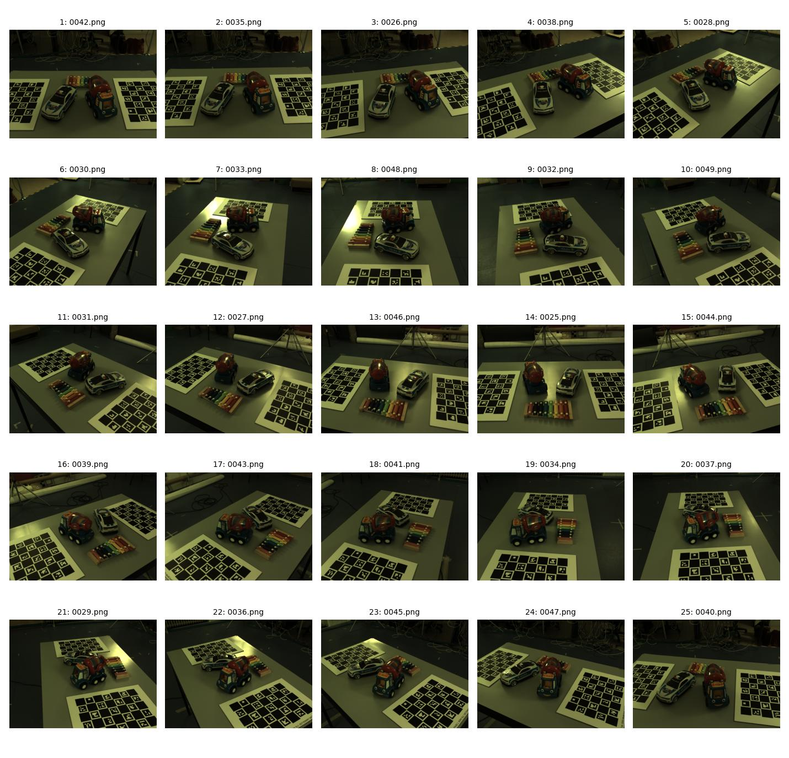
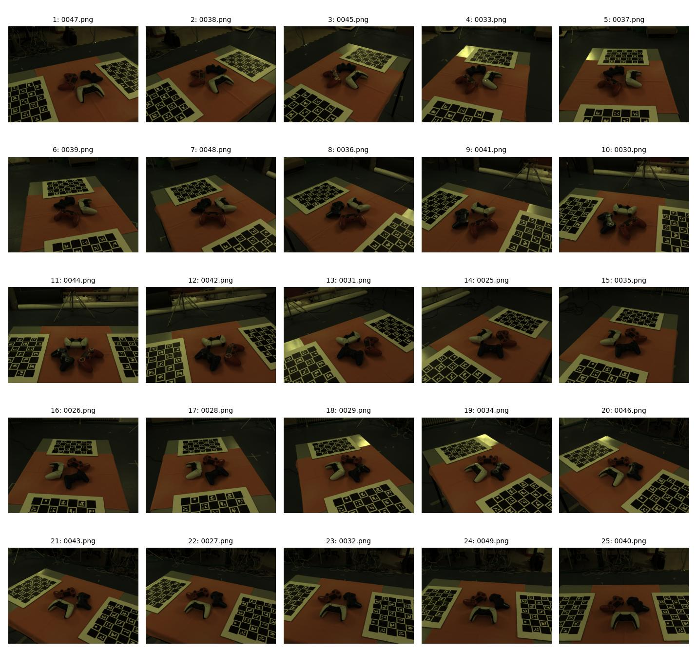

# Methods and measured results

## Project 1 — MEL versus NV

**Data.** Seed-42 balanced sample of 300 actual images from the specified ISIC 2019 dataset: 150 nevus (NV) and 150 melanoma (MEL). Official labels and lesion identifiers were used. The selected manifest and SHA-256 of every JPEG are included. No generated or synthetic images are used for this classifier.

**Segmentation.** Resize to at most 256 pixels on the longer side, preserving aspect ratio. Estimate the peripheral skin color in Lab; threshold weighted color distance with Otsu inside the illuminated field, then close/open the mask, select a substantial central component and fill holes. Excluding the dark camera border from the threshold calculation avoids a demonstrated failure where the black vignette dominated the foreground threshold. Small lesions are retained down to a minimum component area of max(10 pixels, 0.1% of image area).

**Features.** 60 total: nine shape/asymmetry measurements, 36 RGB/Lab/HSV color statistics, ten uniform-LBP bins, four masked GLCM statistics, and one edge-density measurement. Bilateral denoising, black-hat hair inpainting and CLAHE improve the texture representation. Color features use the smoothed image before CLAHE. GLCM pairs require both pixels to be inside the lesion. Diameter is relative to the resized image diagonal; it is not a millimeter measurement. Evolution cannot be inferred from one image.

**Protocol.** One of five stratified group folds is held out: 240 training images and 60 test images, each balanced. Known lesion IDs never overlap across train/test or internal CV folds. 38 of the 300 images lack a lesion ID and therefore use an image-specific group; this does not guarantee patient-disjoint data. Training-only three-fold grouped cross-validation compares nine SVM settings and four random-forest settings. Scaling/imputation are fitted within folds. The winning model is evaluated once on the held-out labels. Preprocessing was inspected on dataset images, so this is an exploratory coursework experiment rather than a prospectively locked external validation study.

| Measurement | Observed value |
| --- | ---: |
| SVM best CV balanced accuracy | 0.7042 |
| Random forest best CV balanced accuracy | 0.7208 |
| Selected model | Random forest |
| Test accuracy / balanced accuracy | 0.7333 |
| Test ROC AUC | 0.7867 |
| Test average precision | 0.8097 |
| Melanoma sensitivity | 0.6333 |
| Nevus specificity | 0.8333 |
| Melanoma F1 | 0.7037 |

Confusion matrix: rows are true [NV, MEL], columns predicted [NV, MEL]: `[[25, 5], [11, 19]]`. In particular, 11 of the 30 test melanomas were missed. The random forest has 250 trees, maximum depth 8, minimum leaf size 2, balanced class weights and seed 42. The saved checkpoint is the model fitted on the training partition, not refitted on the holdout.

**Limitations.** No expert lesion masks were supplied, so segmentation IoU/Dice is not reported. The first three images of each class are shown as illustrative overlays, not as a curated accuracy sample. 2 masks trigger an area-based review flag; the full QC table is included and no samples were excluded. Area flags are not proof of failure. The mask may select only part of a diffuse lesion, confuse ruler/hair artifacts or favor central structures. The balanced 60-image test set is small and does not reflect clinical prevalence. Patient IDs and independent external validation are unavailable. These results cannot support clinical diagnosis.

## Project 2 — Road lanes and vehicles

**Pipeline.** Apply a trapezoidal road ROI, white/yellow paint masks and Canny edges. Probabilistic Hough segments are clustered by bottom intercept and slope; their pairwise intersections vote for the dominant vanishing point. Reject inconsistent extrapolations. Adjacent accepted boundaries form candidate lane regions. Solid/dashed labels use paint occupancy and gaps along each fitted line. Straight-line geometry is an approximation on curved roads.

MobileNet-SSD uses pretrained Pascal VOC weights, confidence threshold 0.30 and NMS, with overlapping crops to preserve small vehicles. No object-detector training or evaluation dataset is implied. Assign each vehicle's box-bottom center to a candidate lane region at that image row. Lane IDs count visible candidate regions from left to right; they are not stable global road-lane numbers.

| Image | Candidate boundaries | Detected vehicles | Estimated ego lane |
| --- | ---: | ---: | ---: |
| road1.png | 4 | 0 | 2 |
| road1b.png | 4 | 0 | 2 |
| road2.jpg | 6 | 0 | N/A |
| road2b.jpg | 5 | 0 | N/A |
| road3.jpg | 2 | 1 | 1 |
| road3b.jpg | 3 | 0 | 1 |
| road4.png | 6 | 1 | N/A |
| road4b.png | 6 | 1 | N/A |

Road2 and road4 show elevated roadside views. The still-image runner explicitly suppresses ego-lane and ego-proximity interpretation for those supplied views. For new roadside images, do not apply the default centered forward-camera assumption without adapting it.

**Alerts and distance.** A vehicle box taller than 18% of image height triggers `close_vehicle_alert`; `ahead_close_alert` additionally requires agreement with the estimated ego lane. This is a configurable image-size heuristic, not a calibrated safety threshold. Default metric distance is null. The Python API accepts focal length in image pixels and an assumed vehicle height to compute z ≈ f·H/h; the assumption is approximate, and focal length must correspond to the processed image resolution. A still image provides only proximity to a boundary, never evidence of a past crossing.

**Video.** Processed the first 90 frames of course video1 (3.60 seconds). Temporal boundary association uses nearest image-space position, exponential smoothing, a center deadband, three-frame side-change persistence, and a 20-frame cooldown. It emitted 0 possible crossing cues and 257 per-frame vehicle detections (not distinct tracked vehicles). The saved annotated MP4 and per-frame records document the run. This short sample has no manually annotated crossing reference and does not establish event accuracy.

**Observed errors.** Background removal changes Hough and detector behavior. Some guardrails remain as false lane boundaries, curved dashed markings can be mislabeled solid, and the small cars in road3/road4 are not all detected. No bounding-box or lane ground truth was provided, so mAP, lane IoU and solid/dashed accuracy are not invented. Double-line classification is not implemented. Video smoothing tracks boundaries, not vehicle identities. The synthetic crossing test checks the intended temporal logic, not road safety performance.

## Project 3 — Closed-loop sequence estimation

**Data.** All 25 upper-loop RGB images from each supplied scene. Input names are shuffled with seed 42 before processing. Filenames are identifiers and are not used to infer neighbors. The challenging ZIP lacked a valid central directory at download time; all required upper-loop members were recovered from complete local headers and verified against their CRCs. The full damaged archive is not asserted to be recoverable.

**Method.** Resize to maximum side 720 and extract up to 1,800 SIFT features. Reciprocal nearest-neighbor ratio matching (0.75) is followed by fundamental-matrix RANSAC (1.5-pixel threshold, confidence 0.995). Require at least 12 matches and 12 geometric inliers. The symmetric score is sqrt(inliers) × inlier ratio × sqrt(4×4-grid coverage). Cost is the negative logarithm of normalized score. Multistart nearest-neighbor and cheapest insertion give candidate Hamiltonian cycles, improved by 2-opt. The closing edge is part of the objective.

Both scene graphs have one connected component and zero unsupported edges in the selected 25-frame cycle. Cost: easy 19.3203; challenging 12.2343. These are optimization diagnostics, not comparable scene-accuracy measurements. Contact-sheet inspection shows a coherent progression around each object arrangement, including the closing transition; local swaps between very similar views remain possible.

**Evaluation limits.** No independently verified ground-truth order was supplied. Numeric filename order is visibly shuffled and must not be treated as the reference. No sequence accuracy is claimed. The reusable evaluation function computes undirected cycle-edge recall and best position agreement over rotations and reversals when a valid reference is available. `geometrically_supported` means every selected edge passed the geometric filter, not that the order is certified correct. Background features, repeated textures, small baselines and near-planar scene structure can mislead fundamental-matrix matching. The solver is a heuristic, not an exact TSP optimizer. NIR, multispectral and joint lower/upper-loop experiments remain optional future work.

## Verification

The algorithm test suite checks known synthetic cycles, rotation/reversal invariance, disconnected-graph warnings, damaged-ZIP recovery and CRC rejection, archive traversal rejection, lane assignment, gradual crossing logic and reset after missed detections, solid/dashed paint runs, circle symmetry, and background exclusion in GLCM texture features. Tests do not stand in for annotated real-data evaluation. All three notebooks are executed in-process with IPython against the saved experiment outputs (the execution environment does not permit Jupyter kernel sockets); optional rerun cells invoke the complete pipelines after data download.
